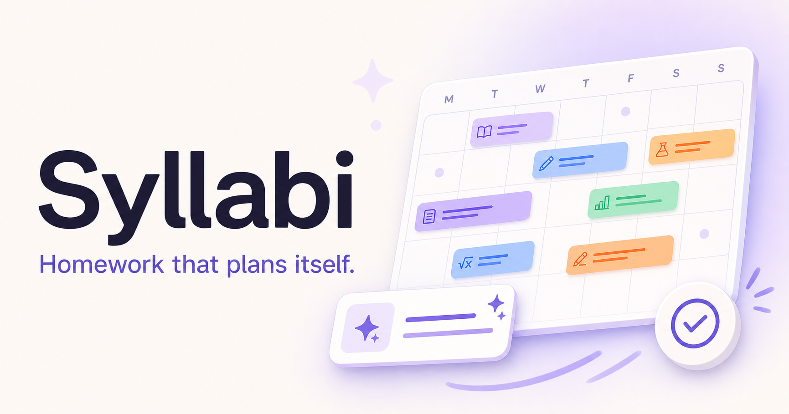
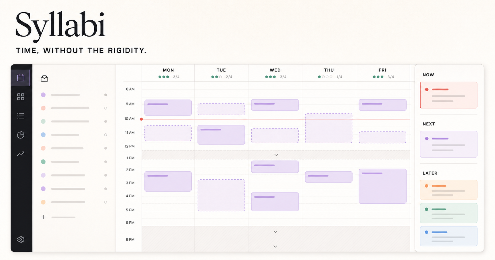
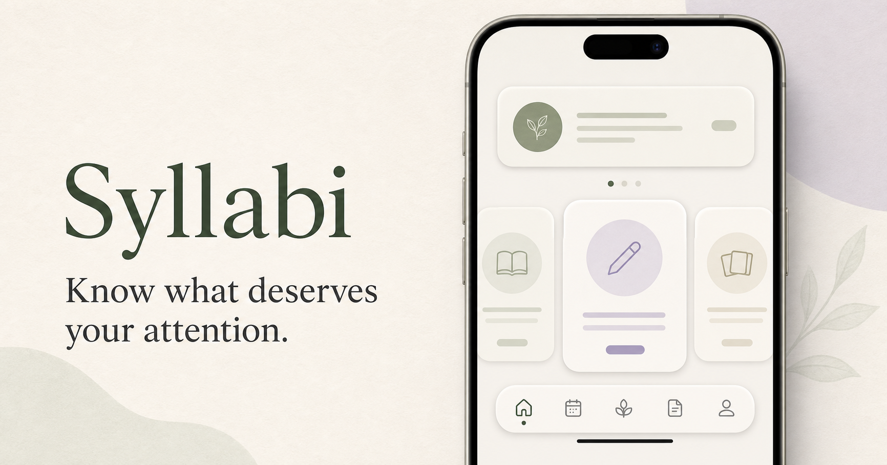

<div align="center">



<h1>Syllabi</h1>

**Time, without the rigidity.**

A calendar for students, where homework is something you *schedule*, not just something you tick off a list.

[Live app](https://cal.charlieva.dev) · [What it does](#what-it-does) · [Try it yourself](#try-it-yourself) · [Questions](#questions)

</div>

---

## The problem

Most school apps give you a to-do list. A to-do list tells you *what* is due. It never tells you **when you are actually going to do it** — and that's the part that decides whether the essay gets written.

Meanwhile your normal calendar is the opposite problem. It only understands things that happen at a fixed time. "Maths homework, roughly 40 minutes, sometime before Thursday" doesn't fit in a box that starts at 4:00 PM sharp.

Syllabi puts both in the same place. Your classes sit where they always sit. Your homework floats until you drop it into a gap. When something takes longer than expected, you drag it; everything else stays put.

## What it does

### 📥 Type it the way you'd say it

One box. Type **"Physics test next Thursday"** or **"read 30 pages of Gatsby before Friday"** and it becomes a real thing in your calendar — with the right subject, the right date, and a sensible guess at how long it'll take.

You don't fill in a form. You don't pick a subject from a dropdown. If something's genuinely unclear, you get asked one short question instead of six.

### 🗓 Your timetable, imported once

Upload a photo or PDF of your school timetable and Syllabi reads the lessons out of it — including the two-week A/B timetables that most calendar apps can't handle. You get a preview of everything it found before anything is added, so you can throw out the rows it got wrong.

After that, your school week just exists. You never type a lesson in by hand.

### ⏳ Homework that has a *when*, not just a *what*



Solid blocks are commitments — the things that happen whether you like it or not. Dashed blocks are your work: movable, resizable, yours to arrange.

- Drag a block to move it; drag its edge to give it more time.
- Blocks snap to the edges of your school periods, so nothing lands halfway through a lesson. Hold <kbd>Option</kbd> / <kbd>Alt</kbd> for exact five-minute control.
- Finished work stays visible but fades back, so the week still reads honestly.
- Shift-click to grab several blocks, then move or delete them together.

### 🎯 "What should I be doing right now?"



Open the **Now** panel and tell it two things: where you are, and how much energy you've got. It looks at what's due, what you've already done, how long you've got before your next commitment, and suggests **one** thing.

Not a ranked list of eleven tasks. One.

It's happy to say "you've got 20 minutes and no laptop, so do the reading" — because it knows the difference between work that needs a screen and work that doesn't.

### 📚 Tests become a plan, not a panic

Add a test with its date and the topics on it, and Syllabi works backwards into several short sessions spread across the weeks before it, rather than one heroic evening the night before. Miss a session and it re-plans around the gap instead of stacking everything onto tomorrow.

### 🔁 A weekly review that takes two minutes

Once a week you get a plain summary of what you planned versus what actually happened, by subject. No scores, no streaks, no guilt-trip notifications — just a clear picture and one suggested adjustment.

### 📶 Works on the train

Syllabi is installable on your phone like a normal app and keeps working with no signal. Anything you add or change offline is saved locally and synced the moment you're back online. You can always see whether you're **Pending**, **Synced**, or **Needs attention**.

### 🌏 A small nice thing

Every day quietly shows its Japanese almanac reading (六曜 / rokuyō), with a short explanation of what it traditionally means. It affects nothing. It's just pleasant.

---

## Try it yourself

You need [Node.js](https://nodejs.org) 22.13 or newer. If that sentence meant nothing to you, install Node from that link and keep going — the rest is copy and paste.

```bash
git clone https://github.com/charliva/ib-calendar.git
cd ib-calendar
cp .env.example .env.local
npm install
npm run dev
```

Then open **http://localhost:3000**.

The app runs on its own from here. To sync across your phone and laptop you'll need a free [Supabase](https://supabase.com) project — open its **Connect** dialog and copy the values into `.env.local`:

```dotenv
NEXT_PUBLIC_SUPABASE_URL=https://your-project.supabase.co
NEXT_PUBLIC_SUPABASE_PUBLISHABLE_KEY=sb_publishable_...
SUPABASE_SECRET_KEY=sb_secret_...
```

> [!IMPORTANT]
> The `NEXT_PUBLIC_` key is meant to be public. The `SUPABASE_SECRET_KEY` is not — it stays on the server and never goes in the browser or in a commit.

Apply the database migrations from `supabase/migrations/` to your project before turning on sync.

<details>
<summary><strong>Optional: language understanding for capture and imports</strong></summary>

Typing homework in plain English, reading a timetable out of a photo, and editing an event by describing the change all get better with a language model behind them. It's optional — there's a built-in offline parser that handles the common cases (dates, times, rooms, durations, recurrence) with no key and no network.

Set a [Vercel AI Gateway](https://vercel.com/docs/ai-gateway) key to enable it:

```dotenv
AI_GATEWAY_API_KEY=...
AI_GATEWAY_MODEL=openai/gpt-5-mini
```

The model ID uses the gateway's `creator/model-name` format, so you can switch to `anthropic/claude-sonnet-4.5` or `google/gemini-2.5-flash` without installing anything or changing code.

Nothing is scheduled, moved, or deleted without you seeing it first and confirming.

</details>

<details>
<summary><strong>Optional: invitations and sign-in emails</strong></summary>

Syllabi is invite-only by design. A signed-in user can generate a single-use link valid for seven days, or send an invitation to a friend's email address; normal sign-in never creates an account on its own. Each user is capped at 10 invitations per 24 hours.

In your Supabase dashboard, turn **off** "Allow new users to sign up" once your own account exists, and point the Magic Link email template at `supabase/templates/magic-link.html` — it uses `{{ .Token }}` so Supabase sends a short typed code rather than a link.

For outbound email, [Resend](https://resend.com)'s free tier is plenty for a class-sized group. Add a dedicated sending subdomain (e.g. `auth.yourdomain.dev`) with the SPF/MX and DKIM records it gives you, then set Supabase's SMTP to `smtp.resend.com`, port `465`, username `resend`, password = your Resend API key.

</details>

---

## Everyday shortcuts

| Do this | Get this |
| --- | --- |
| Click an empty slot | Start a new block right there |
| Drag a block's edge | Change how long it takes |
| Hold <kbd>Option</kbd> / <kbd>Alt</kbd> while dragging | Exact 5-minute placement, ignoring period snapping |
| <kbd>Shift</kbd> + click | Add blocks to a selection |
| <kbd>Delete</kbd> then <kbd>Enter</kbd> | Delete the whole selection |
| <kbd>Esc</kbd> | Close whatever's open |
| Swipe left / right on a phone | Previous / next week |

Editing a class asks whether you mean **just this one**, **every week**, or **only Week A / Week B** — and edits to the future never rewrite the past.

## Under the hood

Next.js 16 and React 19 on Cloudflare Workers, Tailwind 4, Supabase for storage and sign-in (with row-level security, so your rows are genuinely yours), IndexedDB for offline, and Zod for validating anything that arrives from outside.

```
app/        screens and calendar views
components/ the calendar's reusable pieces
lib/        the actual logic — scheduling, parsing, sync, school rules
tests/      ~150 tests, run with `npm test`
supabase/   database migrations
docs/       product notes and architecture
```

```bash
npm run typecheck   # types
npm run lint        # style
npm test            # build, then the full suite
```

## What Syllabi deliberately isn't

- Not a school information system.
- Not something that submits your work for you.
- Not something that changes your calendar without asking.
- Not a grade predictor that pretends to know more than it does.
- No streaks, no leaderboards, no feed, no shame for a missed task.

Parent or mentor sharing, if you ever turn it on, is an opt-in read-only weekly summary. It is not surveillance.

## Questions

**Do I need to know how to code to use this?**
To *use* it, no. To *host your own copy*, you need to be comfortable copying commands into a terminal — the steps above are the whole job.

**Does it replace my Google Calendar?**
It can live alongside it. Syllabi is built for the school half of your life; the plan is to read your existing busy time and publish study blocks back.

**Is my data used to train anything?**
No. Your calendar is in your own Supabase project, protected by row-level security. If you enable the optional language features, only the specific text you're capturing is sent for that one request.

**Why "Syllabi"?**
Because everything in a school year traces back to one.

## Contributing

Issues and specs live in [GitHub Issues](https://github.com/charliva/ib-calendar/issues). Bug reports from students are the most useful thing you can send — especially "my timetable looks like *this* and the import got it wrong."

If you're opening a pull request, run `npm run typecheck`, `npm run lint`, and `npm test` first.

## Security

Found a way to see someone else's schedule? Please report it privately via
[GitHub security advisories](https://github.com/charliva/ib-calendar/security/advisories/new)
rather than opening an issue. Details, scope, and how the app is protected are
in [SECURITY.md](SECURITY.md).

## License

[MIT](LICENSE) — use it, fork it, run it for your own school.

<div align="center"><sub>Built by a student who kept missing deadlines that were already on a list.</sub></div>
